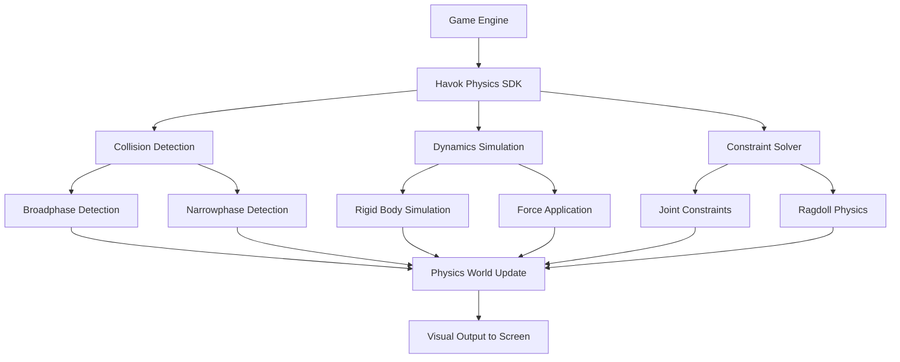
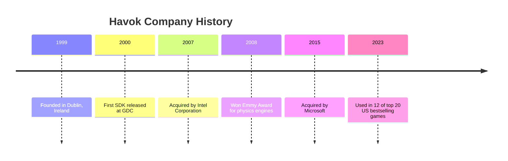
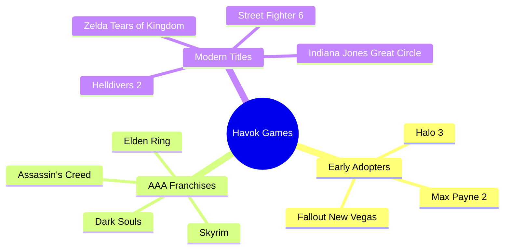

# The Havok Physics Engine: Revolutionizing Game Physics

*The iconic yellow sawblade logo that became synonymous with cutting-edge physics in the 2000s*

## Introduction

Havok is a middleware software suite developed by the Irish company Havok that provides physics engine, navigation, and cloth simulation components for video game engines. For over two decades, Havok has been the gold standard in game physics, powering hundreds of titles and fundamentally changing how players interact with virtual worlds.

## What is Havok Physics?

Havok Physics was originally from Ipion Software (Ipion Virtual Physics) and is designed primarily for video games, allowing for real-time collision and dynamics of rigid bodies in three dimensions. The engine enables realistic physical simulations including:

- **Rigid body dynamics** - Objects behave with realistic mass, velocity, and momentum
- **Collision detection** - Highly optimized library for detecting when objects interact
- **Ragdoll physics** - Realistic character movement and reactions
- **Constraint systems** - Dynamic constraints between rigid bodies for complex interactions

Developed over more than two decades in collaboration with leading game developers, Havok Physics delivers unparalleled high fidelity across expansive worlds filled with numerous physics objects.

## How Havok Physics Works

### Core Components

**1. Physics World Simulation**
In Havok, the physics simulation world is represented by a hkpWorld object, which is initialized by passing the hkpWorldCInfo structure that stores global physics world settings like gravity.

**2. Multithreaded Processing**
Havok Physics can simulate more objects on screen without increasing your physics budget and get predictable results across all supported platforms. The engine uses sophisticated multithreading to maximize performance on modern hardware.

**3. Real-Time Calculations**
The engine processes physics calculations at high frequencies (typically 60Hz) to ensure smooth, responsive gameplay. Each frame:
- Updates object positions and velocities
- Detects collisions between objects
- Resolves constraints and applies forces
- Updates visual representations

## Corporate History

In 2007, Intel acquired Havok Inc. In 2008, Havok was honored at the 59th Annual Technology & Engineering Emmy Awards for advancing the development of physics engines in electronic entertainment. In 2015, Microsoft acquired Havok.

## Iconic Games Using Havok Physics

### Half-Life 2 (2004)

*The Gravity Gun became an iconic demonstration of Havok's physics capabilities*

Valve integrated the Havok physics engine, which simulates real-world physics, to reinforce the player's sense of presence and create new gameplay. Half-Life 2 was revolutionary in its physics implementation:

**Key Features:**
- **Gravity Gun** - Players could manipulate objects with realistic physics
- **Environmental puzzles** - Physics-based problem solving
- **Ragdoll enemies** - Realistic death animations and reactions
- **Interactive environments** - Nearly every object could be moved or destroyed

To experiment, they created a minigame, Zombie Basketball, in which players used a physics-manipulating gun to throw zombies through hoops. This showcased how physics could become a core gameplay mechanic.

Half-Life 2 hailed a new era of the role physics engines play in video games. One of the first games to showcase the Havok engine, Half-Life 2's success sparked the creation of 3rd party physics engines.

### Just Cause 3 (2015)

*Just Cause 3 took physics-based destruction to unprecedented levels*

Just Cause 3 pushed Havok to its limits with massive destruction sequences and physics-driven chaos:

**Technical Achievements:**
The team worked with Havok to incorporate all new destruction techniques that allow them to destroy entire bridges and huge military structures in unique physics-driven ways.

Just Cause 3 has a full implementation of the Havok Destruction physics engine, for massive explosion effects and realistic destruction of all game objects.

**Gameplay Features:**
- **Cascading destruction** - If you tether things correctly you can use them defensively or create cascading destruction – destroying an entire base just by pulling one tether
- **Physics-driven chaos** - The grapple is fully simulated as a dynamic physics constraint, which can attach to any point on a physics object and apply forces
- **Massive scale** - 400 square miles of destructible environment

The nice thing about using the Havok physics is not scripting events – by just placing things in a general area, you create something unique.

## Other Notable Games Using Havok

In 2023, Havok products were used in twelve of the top twenty best selling video games in the United States, including titles like Helldivers 2, The Legend of Zelda: Tears of the Kingdom, and Street Fighter 6.

## Havok's Product Suite

### 1. Havok Physics
The core physics engine providing real-time collision detection, rigid body dynamics, and constraint solving for realistic object behavior.

### 2. Havok Cloth
Havok Cloth aims to have artists have full control of the minuscule details of fabric manipulation with seamless, high-performance integration.

### 3. Havok Navigation
Havok AI provides collision detection and squad capabilities, with crews forming up effectively with flexible and open design for complex actions.

## Technical Advantages

### Performance
- **CPU optimization** - Highly efficient use of processor resources
- **Multithreading** - Leverages multiple cores for maximum performance
- **Scalability** - Handles from small indie games to massive open worlds

### Reliability
Havok Physics is a mature, fully production-ready physics engine that has super-powered hundreds of shipped games, developed with industry-leading solvers that handle complex constraints and shape combinations.

### Cross-Platform Support
As of February 2023, Havok supports 18 targets across 10 platforms including Windows, Linux, Xbox Series S/X, PlayStation 5, iOS, Nintendo Switch and Android.

## Modern Integration

### Unreal Engine 5
Havok Physics for Unreal is an engine level integration that allows seamless swap from the default physics system with no changes to workflow and no custom blueprints to call.

### Unity Engine
Havok Physics for Unity offers higher simulation quality, being a mature engine robust to many use cases, particularly offering welding for stable stacking and smoothing contact points.

## Impact on Gaming

Even the most basic and janky real-time 3D physics simulations were mind-blowing back in the 2000s. After Half-Life 2 came out, with its Gravity Gun and sawblade-flinging, Havok became firmly associated with the cutting edge.

The introduction of Havok physics fundamentally changed game design:

1. **Emergent Gameplay** - Players could experiment with physics in creative ways
2. **Environmental Storytelling** - Realistic physics made worlds feel more alive
3. **Interactive Puzzles** - Physics became a core puzzle-solving mechanic
4. **Combat Innovation** - Ragdoll physics and environmental kills became standard

## The Future of Havok

Recent advancements include Havok Physics Particles for lightweight physics simulation supporting numerous bodies at low cost, Geometry Remeshing for cutting-edge optimization, and Cross Platform Determinism guaranteeing consistent behavior across all supported platforms.

Havok's work to make physics simulations harder to break allows developers to give players a longer leash, putting an awful lot of choice in the hands of the player to tackle things in a pretty open-ended way.

## Conclusion

From its humble beginnings in 1999 to its current status as an industry standard, Havok Physics has been instrumental in creating immersive, realistic gaming experiences. Whether it's the iconic Gravity Gun in Half-Life 2 or the massive destruction in Just Cause 3, Havok continues to push the boundaries of what's possible in interactive entertainment.

As games become increasingly complex and players demand more realistic interactions, Havok remains at the forefront of physics simulation technology, enabling developers to create worlds that feel truly alive and responsive to player actions.

---

*For more information about Havok and its products, visit [havok.com](https://www.havok.com/)*