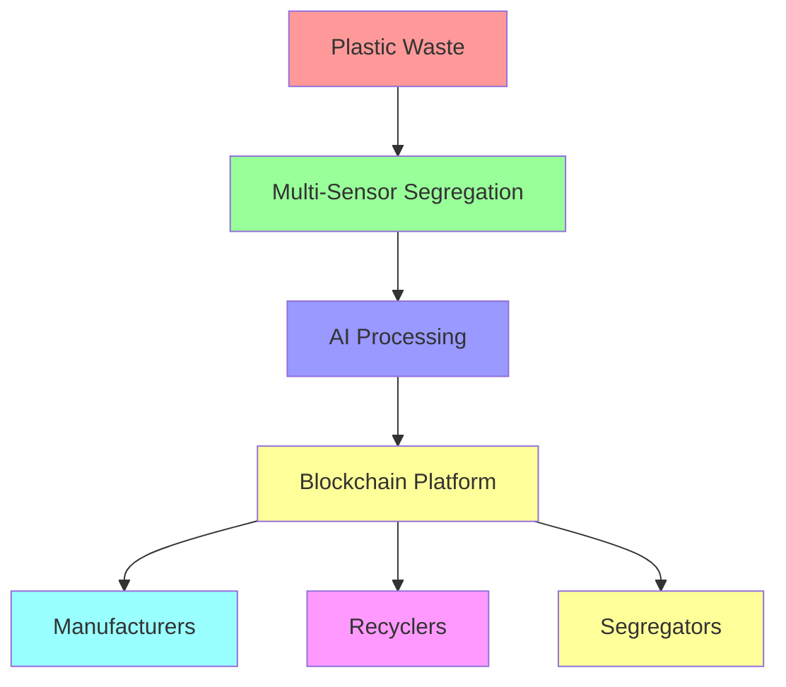
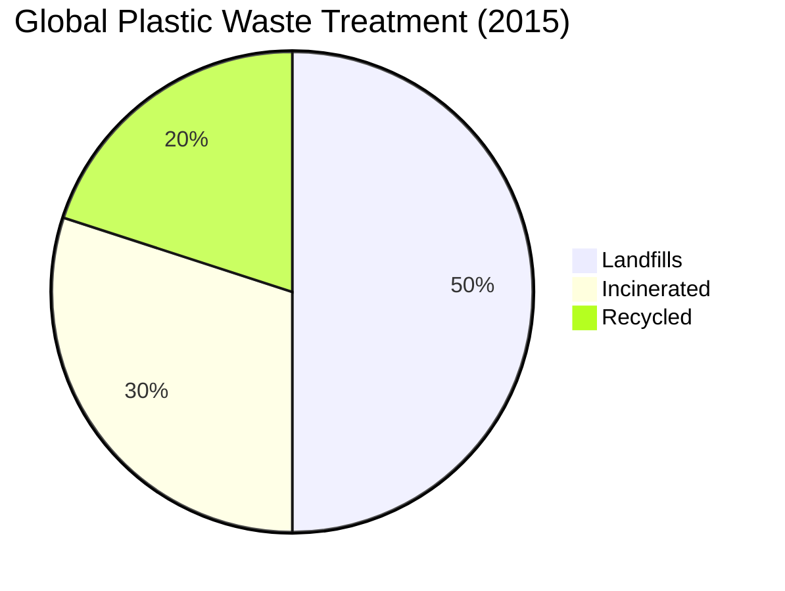
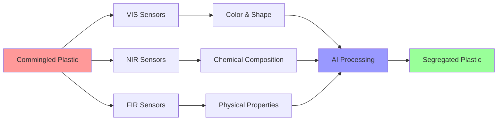
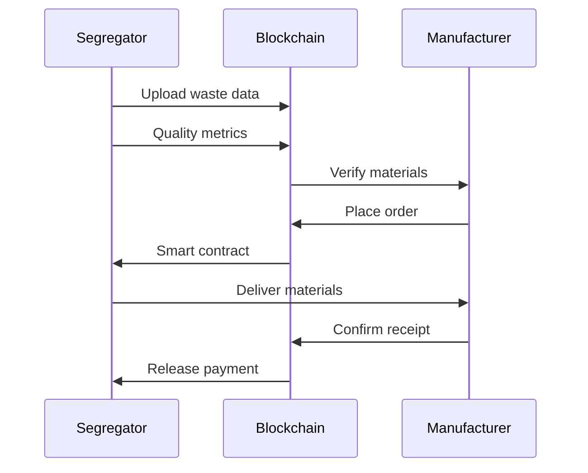

# From Trash to Cash: Revolutionizing Plastic Waste Management with AI and Blockchain

## Introduction

In a world where plastic pollution has become a critical environmental challenge, innovative solutions combining artificial intelligence and blockchain technology are emerging to transform waste management. This blog post explores groundbreaking research on how multi-sensor-driven AI and blockchain can revolutionize the circular economy of plastic waste.

## The Plastic Crisis

By 2050, our oceans could contain more plastic by weight than fish. Current statistics show:
- 15 million tonnes of plastic produced in 1964
- 311 million tonnes in 2014
- 359 million tonnes in 2018
- Expected to triple in next 3-4 decades

## Multi-Sensor AI Solution

The research introduces an innovative approach using three types of sensors:
1. Visual (VIS) sensors
2. Near-infrared (NIR) sensors
3. Far-infrared (FIR) sensors

## Blockchain Integration

The system employs blockchain technology to create a trust-based platform connecting:
- Waste segregators
- Recyclers
- Manufacturers

The blockchain platform enables:
- Transparent tracking of materials
- Quality verification
- Smart contracts
- Efficient pricing
- Supply chain optimization

## Impact and Future

This innovative system achieves:
- 99% accuracy in color-based segregation
- 95-98% accuracy in plastic type segregation
- Improved trust between stakeholders
- Enhanced recycling efficiency
- Reduced environmental impact

The combination of AI and blockchain technology creates a transparent, efficient, and reliable system for plastic waste management, potentially transforming how we handle plastic waste globally.

## References

Research by Chidepatil, A., et al. (2020). From Trash to Cash: How Blockchain and Multi-Sensor-Driven Artificial Intelligence Can Transform Circular Economy of Plastic Waste? Administrative Sciences, 10(2), 23.